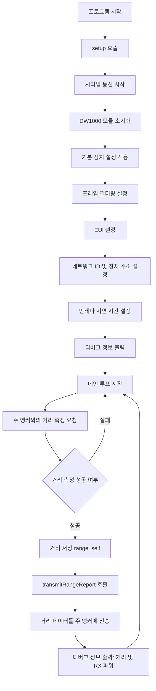

# RTLS 앵커 B TWR 예제

이 프로젝트는 **ISO/IEC 24730-62:2013** 표준을 기반으로 **두 웨이 레이징(TWR)** 기법을 사용하여 실시간 위치 추적 시스템(RTLS)에서 **보조 앵커(Anchor B)** 역할을 수행하는 예제입니다. 앵커 B는 태그 및 다른 앵커들과의 거리 데이터를 주 앵커로 전송합니다. **DW1000Ng** 라이브러리를 사용하여 **DW1000 UWB** 모듈을 제어하며, 거리 데이터를 주기적으로 측정하고 보고합니다.

## 개요

이 코드는 다음과 같은 기능을 포함합니다:
1. **DW1000 모듈 초기화**: UWB 모듈을 초기화하고 설정을 적용합니다.
2. **두 웨이 레이징 (TWR)**: 태그 및 다른 앵커들과의 거리를 측정합니다.
3. **거리 데이터 전송**: 측정된 거리를 주 앵커에 보고합니다.
4. **디버그 정보 출력**: 측정된 거리와 수신 신호 강도를 시리얼 모니터에 출력합니다.

## 코드 흐름



### 코드 흐름 설명

1. **프로그램 시작**: `setup()` 함수가 호출되며, 시리얼 통신을 시작하고 **DW1000 모듈**이 초기화됩니다.
2. **기본 설정 적용**: 기본 장치 설정이 적용되고, 프레임 필터링, **EUI**, **네트워크 ID**, **장치 주소** 및 **안테나 지연 시간**이 설정됩니다.
3. **디버그 정보 출력**: 장치 ID, 고유 식별자, 네트워크 정보 등의 디버그 정보가 시리얼 모니터에 출력됩니다.
4. **메인 루프**: 메인 루프에서 주 앵커로부터 거리 측정 요청을 수신하면, **두 웨이 레이징(TWR)** 방식으로 거리를 측정합니다. 측정된 거리를 `range_self` 변수에 저장한 후, 주 앵커로 데이터를 전송하고, 시리얼 모니터에 디버그 정보를 출력합니다.

## 코드 설명

### 1. **하드웨어 핀 설정 및 변수 선언**
```cpp
const uint8_t PIN_SCK = 18;
const uint8_t PIN_MOSI = 23;
const uint8_t PIN_MISO = 19;
const uint8_t PIN_SS = 4;
const uint8_t PIN_RST = 15;
const uint8_t PIN_IRQ = 17;

const char EUI[] = "AA:BB:CC:DD:EE:FF:00:02";
byte main_anchor_address[] = {0x01, 0x00};
uint16_t next_anchor = 3;
double range_self;
```
- **핀 설정**: SPI 통신을 위한 핀 번호입니다.
- **장치 고유 식별자(EUI)**: 앵커 B의 고유 식별자입니다.
- **거리 데이터**: `range_self` 변수에 태그와의 거리를 저장합니다.

### 2. **DW1000 모듈 설정 및 초기화**

```cpp
device_configuration_t DEFAULT_CONFIG = {
    false, true, true, true, false,
    SFDMode::STANDARD_SFD, Channel::CHANNEL_5,
    DataRate::RATE_850KBPS, PulseFrequency::FREQ_16MHZ,
    PreambleLength::LEN_256, PreambleCode::CODE_3
};

frame_filtering_configuration_t ANCHOR_FRAME_FILTER_CONFIG = {
    false, false, true, false, false, false, false, false
};

void setup() {
    Serial.begin(115200);
    Serial.println(F("### arduino-DW1000Ng-ranging-anchor-B ###"));

    DW1000Ng::initializeNoInterrupt(PIN_SS, PIN_RST);
    Serial.println(F("DW1000Ng initialized ..."));

    DW1000Ng::applyConfiguration(DEFAULT_CONFIG);
    DW1000Ng::enableFrameFiltering(ANCHOR_FRAME_FILTER_CONFIG);
    DW1000Ng::setEUI(EUI);
    DW1000Ng::setPreambleDetectionTimeout(64);
    DW1000Ng::setSfdDetectionTimeout(273);
    DW1000Ng::setReceiveFrameWaitTimeoutPeriod(5000);
    DW1000Ng::setNetworkId(RTLS_APP_ID);
    DW1000Ng::setDeviceAddress(2);
    DW1000Ng::setAntennaDelay(16436);
    Serial.println(F("Committed configuration ..."));

    char msg[128];
    DW1000Ng::getPrintableDeviceIdentifier(msg);
    Serial.print("Device ID: "); Serial.println(msg);
    DW1000Ng::getPrintableExtendedUniqueIdentifier(msg);
    Serial.print("Unique ID: "); Serial.println(msg);
    DW1000Ng::getPrintableNetworkIdAndShortAddress(msg);
    Serial.print("Network ID & Device Address: "); Serial.println(msg);
    DW1000Ng::getPrintableDeviceMode(msg);
    Serial.print("Device mode: "); Serial.println(msg);
}
```
- **설정**: 기본 장치 설정과 프레임 필터링이 적용됩니다.
- **EUI 설정**: 앵커 B의 고유 식별자(EUI)와 네트워크 ID 및 장치 주소가 설정됩니다.
- **디버그 정보**: 설정된 네트워크 정보와 장치 ID를 시리얼 모니터에 출력합니다.

### 3. **거리 데이터 전송**

```cpp
void transmitRangeReport() {
    byte rangingReport[] = {DATA, SHORT_SRC_AND_DEST, DW1000NgRTLS::increaseSequenceNumber(), 0,0, 0,0, 0,0, 0x60, 0,0 };
    DW1000Ng::getNetworkId(&rangingReport[3]);
    memcpy(&rangingReport[5], main_anchor_address, 2);
    DW1000Ng::getDeviceAddress(&rangingReport[7]);
    DW1000NgUtils::writeValueToBytes(&rangingReport[10], static_cast<uint16_t>((range_self * 1000)), 2);
    DW1000Ng::setTransmitData(rangingReport, sizeof(rangingReport));
    DW1000Ng::startTransmit();
}
```
- **거리 보고 패킷 전송**: 거리 데이터를 포함한 패킷을 생성하여 주 앵커에 전송합니다. 패킷에는 네트워크 ID, 송수신 주소, 거리 정보가 포함됩니다.

### 4. **메인 루프: 거리 측정 및 보고**

```cpp
void loop() {
    RangeAcceptResult result = DW1000NgRTLS::anchorRangeAccept(NextActivity::RANGING_CONFIRM, next_anchor);
    if(result.success) {
        delay(2);
        range_self = result.range;
        transmitRangeReport();

        String rangeString = "Range: "; rangeString += range_self; rangeString += " m";
        rangeString += "\t RX power: "; rangeString += DW1000Ng::getReceivePower(); rangeString += " dBm";
        Serial.println(rangeString);
    }
}
```
- **거리 측정**: 주 앵커로부터 거리 측정 요청을 수신하여 두 웨이 레이징(TWR)을 수행합니다.
- **거리 전송**: 측정된 거리 데이터를 주 앵커에 전송하고, 디버그용으로 거리 및 수신 신호 강도를 시리얼 모니터에 출력합니다.

## 결론

이 코드는 **Anchor B**로서 **RTLS 시스템**에서 주 앵커와 통신하며 태그와의 거리 데이터를 수집하고 보고하는 역할을 수행합니다. **두 웨이 레이징(TWR)**을 통해 태그와의 거리를 측정하고, 그 결과를 주 앵커로 전송합니다.