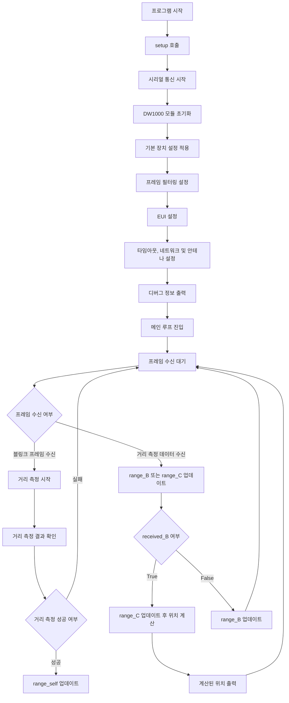

# RTLS 앵커 TWR 예제 (AnchorMain)

이 프로젝트는 **ISO/IEC 24730-62:2013** 표준을 기반으로 **Two-Way Ranging (TWR)** 기법을 사용하여 실시간 위치 추적 시스템(RTLS)의 마스터 앵커 역할을 하는 장치의 구현 예제입니다. 앵커는 태그 및 다른 앵커들과의 거리 데이터를 이용하여 **트릴레테이션(Trilateration)** 방식으로 태그의 위치를 계산합니다. 이 코드는 **DW1000Ng** 라이브러리를 사용하여 **DW1000 UWB 모듈**을 제어합니다.

## 개요

이 코드는 다음과 같은 기능을 포함하고 있습니다:
1. **DW1000 모듈 초기화**: UWB 모듈을 초기화하고 통신 설정을 적용합니다.
2. **슬립 모드 및 프레임 필터링**: 필요하지 않은 프레임을 필터링하여 효율적인 통신을 유지합니다.
3. **두 웨이 레이징 (TWR)**: 태그와 앵커 간의 거리 측정을 수행합니다.
4. **위치 계산**: 측정된 거리 정보를 바탕으로 태그의 좌표를 계산합니다.

## 코드 흐름



### 코드 흐름 설명

- **프로그램 시작**: `setup()` 함수가 호출되어 장치가 초기화되고, 기본 설정이 적용됩니다.
- **DW1000 모듈 초기화**: UWB 모듈이 초기화되고, 필요한 통신 설정이 적용됩니다. 프레임 필터링을 통해 블링크 프레임만 허용되며, 앵커의 EUI 및 네트워크 설정이 적용됩니다.
- **메인 루프**: 메인 루프에서 프레임 수신을 대기하고, 수신된 프레임이 블링크 프레임인 경우, 태그와의 거리 측정을 시작합니다. 거리 측정 데이터가 수신되면, 다른 앵커들(Anchor B와 C)의 거리를 측정한 후 태그의 위치를 계산합니다.

## 코드 설명

### 1. **하드웨어 핀 설정 및 변수 선언**
```cpp
const uint8_t PIN_SCK = 18;
const uint8_t PIN_MOSI = 23;
const uint8_t PIN_MISO = 19;
const uint8_t PIN_SS = 4;
const uint8_t PIN_RST = 15;
const uint8_t PIN_IRQ = 17;

Position position_self = {0, 0};
Position position_B = {2.5, 0};
Position position_C = {2.5, -1.5};

double range_self;
double range_B;
double range_C;
boolean received_B = false;

byte tag_shortAddress[] = {0x05, 0x00};
byte anchor_b[] = {0x02, 0x00};
byte anchor_c[] = {0x03, 0x00};
```
- **핀 설정**: SPI 통신을 위한 핀 번호입니다.
- **위치 및 거리 변수**: 각 앵커의 좌표와 측정된 거리를 저장하는 변수입니다.

### 2. **DW1000 모듈 설정 및 초기화**

```cpp
device_configuration_t DEFAULT_CONFIG = {
    false, true, true, true, false,
    SFDMode::STANDARD_SFD, Channel::CHANNEL_5,
    DataRate::RATE_850KBPS, PulseFrequency::FREQ_16MHZ,
    PreambleLength::LEN_256, PreambleCode::CODE_3
};

void setup() {
    Serial.begin(115200);
    Serial.println(F("### DW1000Ng-arduino-ranging-anchorMain ###"));

    DW1000Ng::initializeNoInterrupt(PIN_SS, PIN_RST);
    Serial.println(F("DW1000Ng initialized ..."));

    DW1000Ng::applyConfiguration(DEFAULT_CONFIG);
    DW1000Ng::enableFrameFiltering(ANCHOR_FRAME_FILTER_CONFIG);
    DW1000Ng::setEUI(EUI);
    DW1000Ng::setNetworkId(RTLS_APP_ID);
    DW1000Ng::setDeviceAddress(1);
    DW1000Ng::setAntennaDelay(16436);
    Serial.println(F("Committed configuration ..."));

    // 디버그용 정보 출력
    char msg[128];
    DW1000Ng::getPrintableDeviceIdentifier(msg);
    Serial.print("Device ID: "); Serial.println(msg);
    DW1000Ng::getPrintableExtendedUniqueIdentifier(msg);
    Serial.print("Unique ID: "); Serial.println(msg);
    DW1000Ng::getPrintableNetworkIdAndShortAddress(msg);
    Serial.print("Network ID & Device Address: "); Serial.println(msg);
}
```
- **설정**: 기본 장치 설정을 적용하고, EUI와 네트워크 ID를 설정합니다.
- **디버깅**: 디바이스 정보와 네트워크 설정을 시리얼 모니터에 출력합니다.

### 3. **태그의 위치 계산 (트릴레테이션)**
```cpp
void calculatePosition(double &x, double &y) {
    double A = ( (-2 * position_self.x) + (2 * position_B.x) );
    double B = ( (-2 * position_self.y) + (2 * position_B.y) );
    double C = (range_self * range_self) - (range_B * range_B) - (position_self.x * position_self.x) + (position_B.x * position_B.x) - (position_self.y * position_self.y) + (position_B.y * position_B.y);
    double D = ( (-2 * position_B.x) + (2 * position_C.x) );
    double E = ( (-2 * position_B.y) + (2 * position_C.y) );
    double F = (range_B * range_B) - (range_C * range_C) - (position_B.x * position_B.x) + (position_C.x * position_C.x) - (position_B.y * position_B.y) + (position_C.y * position_C.y);

    x = (C * E - F * B) / (E * A - B * D);
    y = (C * D - A * F) / (B * D - A * E);
}
```
- **트릴레테이션(trilateration)**을 이용해 태그의 위치를 계산합니다. 앵커 3개의 좌표와 측정된 거리 정보를 이용해 태그의 `(x, y)` 좌표를 계산합니다.

### 4. **메인 루프: 거리 측정 및 위치 계산**
```cpp
void loop() {
    if(DW1000NgRTLS::receiveFrame()) {
        size_t recv_len = DW1000Ng::getReceivedDataLength();
        byte recv_data[recv_len];
        DW1000Ng::getReceivedData(recv_data, recv_len);

        if(recv_data[0] == BLINK) {
            DW1000NgRTLS::transmitRangingInitiation(&recv_data[2], tag_shortAddress);
            DW1000NgRTLS::waitForTransmission();

            RangeAcceptResult result = DW1000NgRTLS::anchorRangeAccept(NextActivity::RANGING_CONFIRM, next_anchor);
            if(!result.success) return;
            range_self = result.range;

        } else if(recv_data[9] == 0x60) {
            double range = static_cast<double>(DW1000NgUtils::bytesAsValue(&recv_data[10],2) / 1000.0);
            if(received_B == false && recv_data[7] == anchor_b[0] && recv_data[8] == anchor_b[1]) {
                range_B = range;
                received_B = true;
            } else if(received_B == true && recv_data[7] == anchor_c[0] && recv_data[8] == anchor_c[1]){
                range_C = range;
                double

 x, y;
                calculatePosition(x, y);
                Serial.print("Found position - x: ");
                Serial.print(x); 
                Serial.print(" y: ");
                Serial.println(y);
                received_B = false;
            } else {
                received_B = false;
            }
        }
    }
}
```
- **블링크 프레임 처리**: 태그에서 보내온 블링크 프레임을 수신하여 거리 측정을 시작합니다.
- **거리 수신 및 위치 계산**: 각 앵커(Anchor B, Anchor C)와 태그 간의 거리를 수신한 후, **calculatePosition()** 함수를 사용하여 태그의 좌표를 계산합니다.

## 결론

이 코드는 **UWB 기반 RTLS 시스템**에서 마스터 앵커 역할을 수행하여, 태그와의 거리 측정과 **트릴레테이션**을 통한 위치 계산을 담당합니다. 3개의 앵커 간의 거리 정보를 기반으로 태그의 정확한 위치를 계산하고, 이를 시리얼 모니터에 출력하는 방식으로 동작합니다.