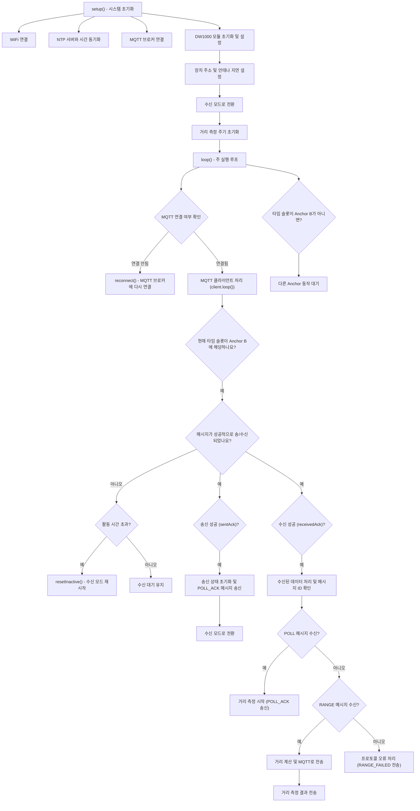

# DW1000Ng 기반의 UWB 거리 측정 시스템 (Anchor B)

이 프로젝트는 **Decawave DW1000Ng** UWB 모듈을 사용하여 **양방향 거리 측정(TWR)**을 구현한 예제입니다. 이 코드는 WiFi, MQTT, NTP 서버와 연동되며, UWB 모듈을 통해 앵커와 태그 사이의 거리를 측정합니다. 타임 슬롯 방식을 통해 Anchor B는 지정된 시간 슬롯에서 동작하며, 결과를 MQTT 서버로 전송합니다.

## 주요 기능

1. **WiFi 연결**: 지정된 SSID와 비밀번호를 통해 WiFi에 연결.
2. **NTP 서버와 시간 동기화**: `pool.ntp.org` NTP 서버를 통해 UTC 시간 동기화.
3. **MQTT 브로커 연결**: MQTT 브로커와 연결하여 거리 측정 결과를 전송.
4. **UWB 모듈 초기화**: Decawave DW1000Ng 모듈을 초기화하고, 타임 슬롯에 따라 거리 측정 수행.
5. **타임 슬롯 방식**: Anchor B는 두 번째 200ms 동안 활성화됩니다.
6. **거리 측정 결과 전송**: 측정된 거리가 13m 이하인 경우, 결과를 MQTT 토픽으로 전송.

## 시스템 흐름

아래는 코드의 전체 흐름을 나타낸 Mermaid 다이어그램입니다:

## 코드 설명

### 1. `setup()`

`setup()` 함수는 시스템의 초기화를 담당합니다.

- **WiFi 연결**: WiFi 네트워크에 연결합니다.
- **NTP 서버와 시간 동기화**: NTP 서버를 통해 시간을 동기화하여 정확한 시간 기준을 설정합니다.
- **MQTT 브로커 연결**: MQTT 브로커에 연결하여 나중에 거리 측정 결과를 전송할 수 있도록 준비합니다.
- **DW1000 모듈 초기화**: DW1000 UWB 모듈을 초기화하고, 기본 설정을 적용합니다.
- **수신 모드 전환**: 초기화 후 수신 모드로 전환하여 태그의 POLL 메시지를 대기합니다.

### 2. `loop()`

`loop()` 함수는 주 실행 루프로, 각 타임 슬롯에 맞춰 앵커가 동작합니다.

- **MQTT 연결 상태 확인**: MQTT 연결이 끊어진 경우 재연결을 시도합니다.
- **타임 슬롯 확인**: 현재 시간이 Anchor B에 해당하는 타임 슬롯인지 확인합니다.
- **메시지 처리**: 송신 또는 수신된 메시지가 있는지 확인하고, 메시지에 따라 적절한 처리를 수행합니다.
  - **POLL 메시지 수신**: 태그로부터 POLL 메시지를 수신하면 POLL_ACK 메시지를 응답으로 보냅니다.
  - **RANGE 메시지 수신**: 태그로부터 RANGE 메시지를 수신하면 거리를 계산하고 결과를 MQTT로 전송합니다.

### 3. 타임 슬롯 방식

코드는 타임 슬롯 방식으로 동작하며, Anchor B는 두 번째 200ms 동안 활성화됩니다. 총 3개의 앵커가 있으며, 각각의 앵커는 고유한 타임 슬롯에서 동작합니다.

### 4. 거리 측정

거리 계산은 `DW1000NgRanging::computeRangeAsymmetric` 함수를 사용하여 비대칭 거리 측정 알고리즘을 통해 계산됩니다. 계산된 거리는 13m 이하일 경우 MQTT 브로커로 전송됩니다.

## 설정

- **WiFi SSID** 및 **비밀번호**: 프로젝트의 WiFi 설정은 `WIFI_SSID` 및 `WIFI_PASSWORD`로 지정됩니다.
- **MQTT 브로커**: `MQTT_SERVER` 및 `MQTT_PORT`를 통해 MQTT 브로커 정보가 설정됩니다.
- **타임 슬롯**: 타임 슬롯의 길이는 200ms로 설정되어 있으며, Anchor B는 두 번째 타임 슬롯에서 동작합니다.

## 사용 방법

1. **WiFi 및 MQTT 설정**: `moduleConfig.h` 파일에서 WiFi SSID, 비밀번호, MQTT 브로커 정보를 설정합니다.
2. **코드 업로드**: 코드를 ESP32 또는 지원되는 장치에 업로드합니다.
3. **장치 연결**: 장치가 WiFi에 연결되고, MQTT 브로커와 연결된 상태에서 UWB 거리 측정을 수행합니다.

## 라이선스

이 프로젝트는 **MIT License**에 따라 라이선스가 부여됩니다. 소스 코드는 자유롭게 수정 및 배포할 수 있습니다.