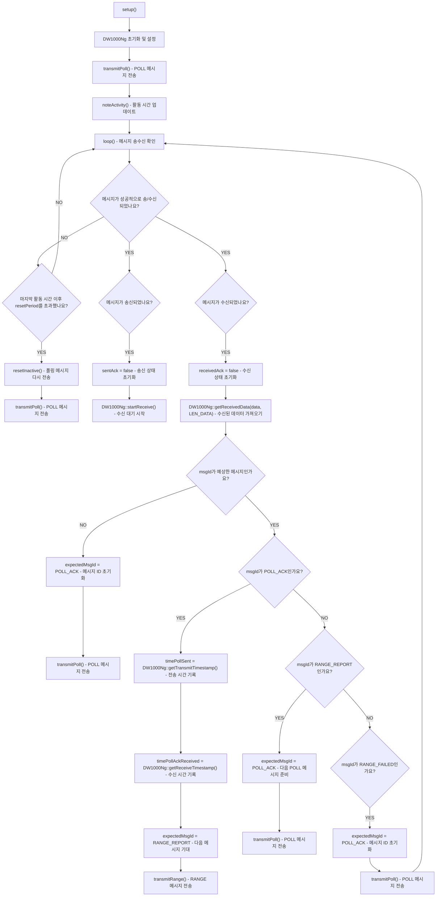

# Decawave DW1000과 Arduino를 이용한 Ranging Tag

이 프로젝트는 Decawave DW1000 UWB 모듈을 사용하여 두 장치 간의 거리를 측정하는 **양방향 거리 측정(TWR)** 기능을 구현한 코드입니다. 이 코드는 "Tag" 역할을 하며, 앵커(Anchor)와 통신하여 두 장치 사이의 거리를 계산합니다.

## 개요

이 코드는 `POLL` 메시지를 앵커 장치로 보내면서 두 장치 간 거리 측정 세션을 시작합니다. 앵커는 `POLL_ACK`으로 응답하며, 태그는 이를 받은 후 관련 시간 정보를 포함한 `RANGE` 메시지를 앵커로 보냅니다. 이 과정을 통해 양쪽 장치는 서로 간의 거리를 계산할 수 있습니다.

코드의 주요 특징:
- **DW1000Ng 초기화:** 드라이버는 SPI 설정과 핀 구성과 함께 초기화됩니다.
- **폴링(Polling) 메커니즘:** 태그는 반복적으로 앵커로 `POLL` 메시지를 보냅니다.
- **메시지 처리:** 메시지가 성공적으로 송수신되면 해당 핸들러가 호출됩니다.
- **타임아웃:** 일정 시간 동안 메시지가 수신되지 않으면 태그가 리셋되고 재시도합니다.

## 코드 흐름

아래는 코드의 실행 흐름을 Mermaid 다이어그램으로 나타낸 것입니다:

## 주요 구성 요소

### 상수 및 설정

- **SPI 핀 구성:**
  - `PIN_SCK`, `PIN_MOSI`, `PIN_MISO`, `PIN_SS`, `PIN_RST`, `PIN_IRQ`는 SPI 통신 및 DW1000 모듈 리셋에 사용되는 핀을 정의합니다.
  
- **메시지 ID:**
  - `POLL`, `POLL_ACK`, `RANGE` 등의 상수로 정의된 메시지 ID는 거리 측정 프로토콜에서 서로 다른 메시지 유형을 구분하는 데 사용됩니다.

- **설정 구조체:**
  - `DEFAULT_CONFIG` 및 `DEFAULT_INTERRUPT_CONFIG`는 UWB 모듈의 구성과 인터럽트 설정을 정의합니다.

### 함수 설명

- **setup():**  
  DW1000Ng UWB 모듈을 초기화하고 설정을 적용하며 첫 번째 `POLL` 메시지 전송을 시작합니다.

- **loop():**  
  송수신된 메시지의 상태를 지속적으로 확인하며, 범위 측정 프로토콜의 다음 단계를 처리하거나 타임아웃이 발생한 경우 태그를 재설정합니다.

- **handleSent():**  
  메시지가 성공적으로 전송되면 호출되는 콜백 함수입니다.

- **handleReceived():**  
  메시지가 성공적으로 수신되면 호출되는 콜백 함수입니다.

- **transmitPoll():**  
  거리 측정 과정을 시작하기 위해 `POLL` 메시지를 앵커로 전송합니다.

- **transmitRange():**  
  `RANGE` 메시지를 전송하며, 거리 계산에 필요한 타임스탬프 정보를 포함합니다.

- **noteActivity():**  
  장치가 비활성 상태에 빠지지 않도록 마지막 활동 시간을 업데이트합니다.

- **resetInactive():**  
  일정 시간 동안 메시지가 교환되지 않으면 새로운 `POLL` 메시지를 전송하여 거리 측정 세션을 재설정합니다.

## 동작 방식

1. **초기화:**  
   `setup()` 단계에서 DW1000Ng UWB 모듈이 설정되며, SPI 핀과 네트워크 ID, 안테나 지연 등의 설정이 적용됩니다.

2. **폴링 메시지 전송:**  
   태그는 앵커로 `POLL` 메시지를 보내면서 거리 측정 세션을 시작합니다. 이는 `transmitPoll()` 함수에서 처리됩니다.

3. **메시지 처리:**  
   시스템은 메시지가 성공적으로 송수신될 때 호출되는 콜백 함수(`handleSent()`, `handleReceived()`)를 사용합니다.

4. **타임아웃 처리:**  
   지정된 `resetPeriod` 내에 메시지가 수신되지 않으면 시스템은 `resetInactive()`를 호출하여 태그를 재설정하고 새로운 `POLL` 메시지를 전송합니다.

5. **거리 측정 과정:**  
   `POLL_ACK` 메시지를 수신하면 태그는 전송 및 수신 시간을 계산하고 관련 타임스탬프 정보를 포함한 `RANGE` 메시지를 앵커로 전송합니다.

6. **거리 계산:**  
   `RANGE_REPORT` 메시지는 계산된 거리를 포함하며, 이를 통해 태그는 새로운 폴링 세션을 시작합니다.

## 라이선스

이 프로젝트는 **MIT 라이선스**와 **Apache License, Version 2.0**에 따라 라이선스가 부여됩니다. 소스 코드에 포함된 두 라이선스 중 하나를 선택하여 사용할 수 있습니다.