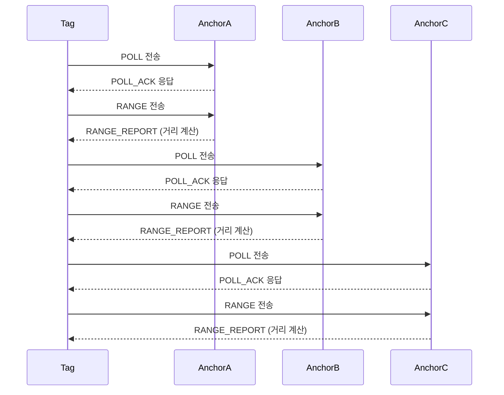

# UWB 기반 양방향 거리 측정 시스템

이 프로젝트는 **Decawave DW1000Ng** UWB 모듈을 사용하여 **양방향 거리 측정(TWR)**을 구현한 예제입니다. 이 시스템은 **Tag**와 **Anchors**(A, B, C)로 구성되며, 각각의 장치가 특정 역할을 수행하여 태그와 앵커 사이의 거리를 측정합니다.

## 시스템 구성

1. **Tag**: 거리 측정을 시작하는 장치입니다. POLL 메시지를 전송하고, 앵커로부터 POLL_ACK를 수신한 후 RANGE 메시지를 보내 거리 측정을 수행합니다.
2. **Anchor A, B, C**: 태그의 POLL 메시지를 수신하여 POLL_ACK 메시지로 응답하고, RANGE 메시지를 통해 거리 정보를 처리합니다. 각 앵커는 **타임 슬롯 방식**을 사용하여 특정 시간에만 활성화됩니다.

## 주요 기능

- **양방향 거리 측정**: 태그와 앵커 사이의 왕복 시간을 이용해 거리를 계산합니다.
- **타임 슬롯 방식**: 각 앵커가 고유한 타임 슬롯에서 동작하여 간섭을 피합니다.
- **MQTT 통신**: 앵커에서 계산된 거리를 MQTT 브로커로 전송할 수 있습니다.

## Tag와 Anchor 간의 상호작용

아래 Sequence Diagram은 Tag와 Anchors 간의 메시지 교환을 시각적으로 보여줍니다.

### Sequence Diagram 설명

1. **Tag와 Anchor 간의 상호작용**: 
   - Tag는 **POLL** 메시지를 앵커에게 전송하여 거리 측정을 시작합니다.
   - 앵커는 **POLL_ACK** 메시지로 응답하고, 이후 Tag는 **RANGE** 메시지를 전송합니다.
   - 앵커는 **RANGE_REPORT** 메시지를 통해 계산된 거리를 Tag에게 전달합니다.

2. **타임 슬롯 방식**:
   - AnchorA는 첫 번째 타임 슬롯(0~200ms) 동안 동작하며, 이 시간에 Tag와 통신합니다.
   - AnchorB는 두 번째 타임 슬롯(200~400ms) 동안 동작하며, Tag와 통신합니다.
   - AnchorC는 세 번째 타임 슬롯(400~600ms) 동안 동작하며, Tag와 통신합니다.

## 타임 슬롯 방식

각 앵커는 일정 시간 간격으로 돌아가면서 동작합니다. 600ms 주기로 3개의 앵커가 순차적으로 활성화됩니다.

- **Anchor A**: 0~200ms
- **Anchor B**: 200~400ms
- **Anchor C**: 400~600ms

이 방식은 UWB 시스템 간의 충돌을 방지하고, 각 앵커가 독립적으로 동작할 수 있도록 합니다.

## Tag의 역할

1. **POLL 메시지 전송**: 거리 측정을 시작하기 위해 앵커에게 POLL 메시지를 전송합니다.
2. **POLL_ACK 수신**: 앵커로부터 응답(POLL_ACK)을 받습니다.
3. **RANGE 메시지 전송**: 거리 계산을 위해 RANGE 메시지를 앵커에게 전송합니다.
4. **RANGE_REPORT 수신**: 앵커로부터 계산된 거리 값을 수신합니다.

## Anchors의 역할 (A, B, C)

1. **POLL 메시지 수신**: Tag로부터 POLL 메시지를 수신합니다.
2. **POLL_ACK 응답**: Tag에게 응답 메시지(POLL_ACK)를 전송합니다.
3. **RANGE 메시지 수신**: Tag로부터 RANGE 메시지를 수신하여 거리를 계산합니다.
4. **RANGE_REPORT 전송**: 계산된 거리 정보를 Tag에게 전송합니다.

## 설정 방법

1. **WiFi 및 MQTT 설정**: 각 앵커와 태그의 `moduleConfig.h` 파일에서 WiFi SSID, 비밀번호, MQTT 브로커 정보를 설정합니다.
2. **코드 업로드**: 각 장치(ESP32 또는 지원되는 장치)에 코드를 업로드합니다.
3. **장치 연결**: 장치가 WiFi에 연결되고, MQTT 브로커와 연결된 상태에서 거리 측정을 수행합니다.

## 라이선스

이 프로젝트는 **MIT License**에 따라 라이선스가 부여됩니다. 소스 코드는 자유롭게 수정 및 배포할 수 있습니다.