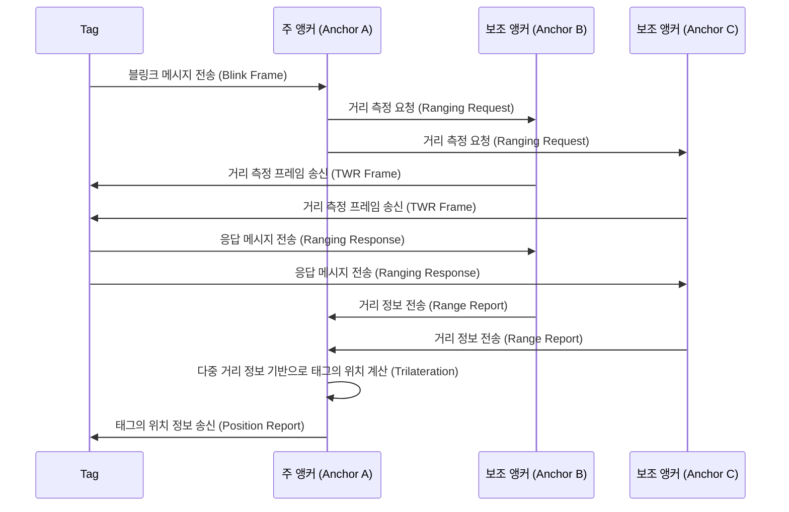
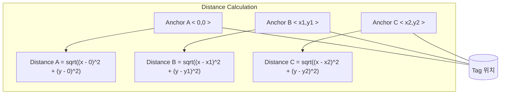

# RTLS 시스템 개요 (주 앵커, 보조 앵커, 태그 간의 통신)

이 프로젝트는 **ISO/IEC 24730-62:2013** 표준에 기반한 **실시간 위치 추적 시스템(RTLS)**으로, **두 웨이 레이징(TWR, Two-Way Ranging)** 기법을 사용하여 주 앵커, 보조 앵커, 태그 간의 통신을 통해 실내 위치를 계산합니다. **DW1000 UWB 모듈**을 활용하여 각 장치들이 서로 통신하며, 태그의 정확한 위치를 측정하는 데 사용됩니다.

## 시스템 구성 요소

1. **주 앵커 (Anchor A)**: 시스템의 중앙 허브 역할을 하며, 보조 앵커 및 태그와 통신하여 태그의 위치를 계산하는 주체입니다.
2. **보조 앵커 (Anchor B, Anchor C)**: 주 앵커와 통신하며, 태그와의 거리를 측정하여 주 앵커에 보고합니다.
3. **태그 (Tag)**: 위치를 측정할 대상이며, 앵커들과 통신하여 거리를 측정합니다.

## 통신 및 위치 측위 로직

### 전체 시스템 흐름

### 통신 및 위치 측정 설명

1. **태그 (Tag)**는 일정한 주기로 **블링크 프레임**을 전송하여 자신이 존재하고 있음을 시스템에 알립니다. 이 프레임은 주 앵커(Anchor A)에 의해 수신됩니다.
2. **주 앵커 (Anchor A)**는 블링크 메시지를 수신한 후, **보조 앵커 (Anchor B, Anchor C)**에 각각 **거리 측정 요청(Ranging Request)**을 보냅니다.
3. **보조 앵커 (Anchor B, Anchor C)**는 태그와 직접 통신하여 **두 웨이 레이징(TWR)** 과정을 시작합니다. 이를 통해 태그와의 거리를 측정합니다.
4. 태그는 보조 앵커로부터 수신된 **거리 측정 프레임(TWR Frame)**에 대한 응답 메시지를 각각 보냅니다.
5. **보조 앵커 (Anchor B, Anchor C)**는 측정된 거리 정보를 **주 앵커 (Anchor A)**에 **거리 보고(Range Report)** 형태로 전송합니다.
6. **주 앵커 (Anchor A)**는 보조 앵커들로부터 받은 거리 데이터를 바탕으로 **트릴레테이션(Trilateration)** 기법을 사용하여 태그의 위치를 계산합니다.
7. 마지막으로, **주 앵커**는 계산된 위치 정보를 **태그**에 송신하여 태그의 정확한 좌표를 보고합니다.

## Trilateration을 통한 위치 계산

**트릴레테이션(Trilateration)**은 태그와 최소 3개의 앵커 사이의 거리를 바탕으로, 태그의 좌표를 계산하는 방식입니다. 각 앵커는 고정된 위치에 있으며, 태그와의 거리를 측정하여 이를 기반으로 2D 평면 상의 위치를 계산할 수 있습니다.

### 트릴레테이션 다이어그램

각 앵커로부터 측정된 거리 정보를 기반으로 태그의 위치를 계산하는 수식은 다음과 같습니다:

- **Anchor A**와의 거리 \(D_A\)는 \(D_A = \sqrt{(x - 0)^2 + (y - 0)^2}\)
- **Anchor B**와의 거리 \(D_B\)는 \(D_B = \sqrt{(x - x1)^2 + (y - y1)^2}\)
- **Anchor C**와의 거리 \(D_C\)는 \(D_C = \sqrt{(x - x2)^2 + (y - y2)^2}\)

이 거리 계산식을 통해 각 앵커와 태그 간의 거리를 구하고, 이를 바탕으로 태그의 정확한 좌표 \(x, y\)를 추정할 수 있습니다.

## 시스템 기능

- **두 웨이 레이징(TWR)**: 태그와 각 앵커 간의 거리를 정밀하게 측정하기 위한 두 방향 통신 방식입니다.
- **트릴레테이션(Trilateration)**: 앵커들과의 거리 데이터를 기반으로 태그의 위치를 추정하는 알고리즘입니다.
- **실시간 위치 추적**: 주 앵커는 보조 앵커들로부터 받은 데이터를 바탕으로 태그의 위치를 실시간으로 추적합니다.

## 결론

이 시스템은 **UWB 기술**을 활용한 **RTLS(실시간 위치 추적 시스템)**으로, 태그와 주 앵커 및 보조 앵커 간의 통신을 통해 태그의 위치를 계산하는 구조를 가지고 있습니다. **두 웨이 레이징(TWR)** 기법과 **트릴레테이션(Trilateration)** 알고리즘을 결합하여, 정확한 실내 위치 추적을 수행할 수 있습니다.