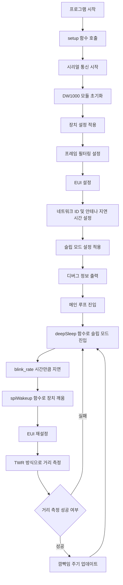

# RTLS 태그 TWR 예제

이 프로젝트는 **ISO/IEC 24730-62:2013** 표준을 기반으로 **두 웨이 레이징(TWR, Two-Way Ranging)** 기법을 사용하여 실시간 위치 추적 시스템(RTLS)에서 태그 역할을 수행하는 예제입니다. 이 코드는 **DW1000Ng** 라이브러리를 사용하여 **DecaWave DW1000 UWB(Ultra-Wideband)** 모듈을 제어하며, 시스템 내에서 UWB 노드 간의 거리를 측정합니다.

## 개요

이 코드는 다음과 같은 기능을 구현합니다:
1. **DW1000 모듈 초기화**: UWB 모듈을 초기화하고, 특정 설정 매개변수를 적용합니다.
2. **슬립 모드 구성**: 장치가 유휴 상태일 때 슬립 모드로 진입하여 저전력 동작을 수행합니다.
3. **두 웨이 레이징(TWR)**: 두 노드 간의 메시지 왕복 시간을 측정하여 거리를 계산합니다.
4. **동적 깜빡임 속도**: 거리 측정 결과에 따라 깜빡임 속도를 조정합니다.

### 주요 구성 요소:
- **device_configuration_t**: 채널, 데이터 전송 속도, 펄스 주파수 및 프리앰블 길이와 같은 장치 설정을 포함합니다.
- **frame_filtering_configuration_t**: 특정 유형의 메시지만 수신하도록 프레임 필터링을 설정합니다.
- **sleep_configuration_t**: 전력 절약을 위한 슬립 모드를 구성합니다.

## 코드 흐름



### 코드 설명

### 1. **setup 함수**
`setup()` 함수는 UWB 모듈을 초기화하고, 설정을 적용하며 디버그 정보를 출력합니다.

```cpp
void setup() {
    Serial.begin(115200);           // 시리얼 통신 시작 (속도: 115200)
    Serial.println(F("### DW1000Ng-arduino-ranging-tag ###"));  // 초기 메시지 출력

    // DW1000 모듈을 인터럽트 없이 초기화
    #if defined(ESP8266)
    DW1000Ng::initializeNoInterrupt(PIN_SS);  
    #else
    DW1000Ng::initializeNoInterrupt(PIN_SS, PIN_RST);  
    #endif
    Serial.println("DW1000Ng initialized ...");

    // 기본 장치 설정 적용
    DW1000Ng::applyConfiguration(DEFAULT_CONFIG);

    // 프레임 필터링 활성화
    DW1000Ng::enableFrameFiltering(TAG_FRAME_FILTER_CONFIG);

    // 장치의 고유 식별자(EUI) 설정
    DW1000Ng::setEUI(EUI);

    // 네트워크 ID 및 안테나 지연 시간 설정
    DW1000Ng::setNetworkId(RTLS_APP_ID);
    DW1000Ng::setAntennaDelay(16436);  // 안테나 지연 시간 설정

    // 슬립 모드 설정 적용
    DW1000Ng::applySleepConfiguration(SLEEP_CONFIG);

    // 다양한 타임아웃 설정
    DW1000Ng::setPreambleDetectionTimeout(15);
    DW1000Ng::setSfdDetectionTimeout(273);
    DW1000Ng::setReceiveFrameWaitTimeoutPeriod(2000);

    // 디버그 정보 출력
    char msg[128];
    DW1000Ng::getPrintableDeviceIdentifier(msg);
    Serial.print("Device ID: "); Serial.println(msg);
    DW1000Ng::getPrintableExtendedUniqueIdentifier(msg);
    Serial.print("Unique ID: "); Serial.println(msg);
    DW1000Ng::getPrintableNetworkIdAndShortAddress(msg);
    Serial.print("Network ID & Device Address: "); Serial.println(msg);
    DW1000Ng::getPrintableDeviceMode(msg);
    Serial.print("Device mode: "); Serial.println(msg);
}
```

### 2. **메인 루프 함수**
`loop()` 함수는 장치가 슬립 모드로 진입하고, 두 웨이 레이징(TWR) 방식으로 거리를 측정하며 깜빡임 속도를 동적으로 조정하는 작업을 수행합니다.

```cpp
void loop() {
    DW1000Ng::deepSleep();  // 슬립 모드로 진입하여 전력 절약
    delay(blink_rate);  // 깜빡임 속도에 따라 지연

    DW1000Ng::spiWakeup();  // SPI로 슬립 모드 해제
    DW1000Ng::setEUI(EUI);  // EUI 재설정

    // 두 웨이 레이징(TWR)을 수행 (타임아웃: 1500ms)
    RangeInfrastructureResult res = DW1000NgRTLS::tagTwrLocalize(1500);  
    if(res.success)  // 거리 측정이 성공하면
        blink_rate = res.new_blink_rate;  // 새로운 깜빡임 속도 설정
}
```

### 코드 설정
코드의 시작 부분에서 다양한 설정을 정의합니다:

1. **장치 설정**: 채널, 데이터 전송 속도, 펄스 주파수 및 프리앰블 길이와 같은 설정을 정의합니다.
    ```cpp
    device_configuration_t DEFAULT_CONFIG = {
        false,                          // 확장된 프레임 길이 비활성화
        true,                           // 수신 자동 재활성화
        true,                           // 스마트 전력 관리 활성화
        true,                           // 프레임 체크(CRC) 활성화
        false,                          // NLOS 모드 비활성화
        SFDMode::STANDARD_SFD,          // 표준 SFD 모드 사용
        Channel::CHANNEL_5,             // UWB 채널 5 사용
        DataRate::RATE_850KBPS,         // 데이터 전송 속도 850KBPS 설정
        PulseFrequency::FREQ_16MHZ,     // 펄스 주파수 16MHz 설정
        PreambleLength::LEN_256,        // 프리앰블 길이 256
        PreambleCode::CODE_3            // 프리앰블 코드 3 사용
    };
    ```

2. **프레임 필터링 설정**: 특정 메시지 유형만 수신하도록 필터링합니다.
    ```cpp
    frame_filtering_configuration_t TAG_FRAME_FILTER_CONFIG = {
        false,  // 코디네이터 모드 비활성화
        false,  // 비콘 프레임 비허용
        true,   // 데이터 프레임 허용
        false,  // 확인 프레임 비허용
        false,  // MAC 명령 프레임 비허용
        false,  // 예약된 필드 비허용
        false,  // 추가 예약 필드 4 비허용
        false   // 추가 예약 필드 5 비허용
    };
    ```

3. **슬립 모드 설정**: 전력 절약을 위한 슬립 모드 설정입니다.
    ```cpp
    sleep_configuration_t SLEEP_CONFIG = {
        false,  // 깨어날 때 ADC 실행 안함
        false,  // 깨어날 때 수신 안함
        false,  // 깨어날 때 EUI 로드 안함
        true,   // 깨어날 때 L64 매개변수 로드
        true,   // 슬립 모드 유지
        true,   // 슬립 모드 활성화
        false,  // 웨이크업 핀 비활성화
        true    // SPI로 깨우기 활성화
    };
    ```

## 하드웨어 연결

| 핀 이름  | 설명           | ESP32 핀 번호 |
|----------|----------------|---------------|
| **SCK**  | SPI 클럭 핀    | 18            |
| **MOSI** | SPI 데이터 출력 | 23            |
| **MISO** | SPI 데이터 입력 | 19            |
| **SS**   | 슬레이브 선택   | 4             |
| **RST**  | 리셋 핀        | 15            |
| **IRQ**  | 인터럽트 핀     | 17            |

## 라이센스
이 프로젝트는 MIT 라이센스에 따라 배포됩니다. 자세한 내용은 [LICENSE](LICENSE) 파일을 참조하십시오.